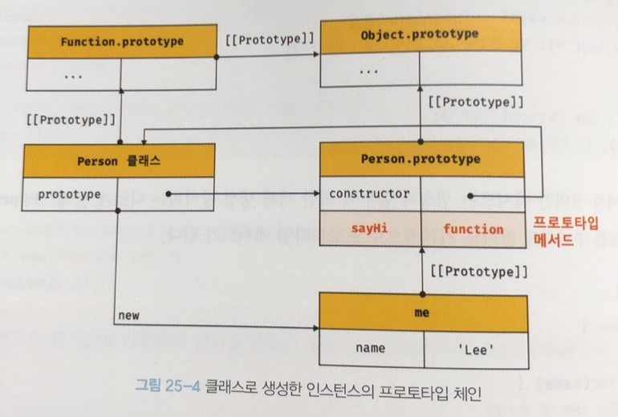
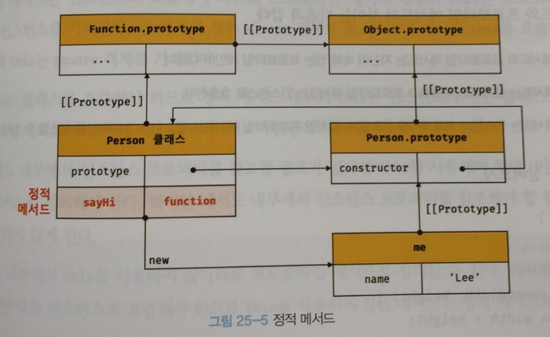

# 25장 클래스

## **클래스는 프로토타입의 문법적 설탕인가?**

<br>

### **클래스와 생성자 함수 차이**

|클래스|생성자 함수|
|----|--------|
|new 연산자 없이 호출하면 에러가 발생한다. | new 연산자 없이 호출하면 일반 함수로서 호출된다.|
|상속을 지원하는 extends와 super 키워드를 제공한다 | extends와 super 키워드를 지원하지 않는다.|
|호이스팅이 발생하지 않는 것처럼 동작한다.|함수 선언문으로 정의된 생성자 함수는 함수 호이스팅이, 함수 표현식으로 정의한 생성자 함수는 변수 호이스팅이 발생한다.|
|모든 코드에는 암묵적으로 strict mode가 지정되어 실행되며 strict mode를 해제할 수 없다.|암묵적으로 strict mode가 지정되지 않는다.|
|클래스의 constructor, 프로토타입 메서드, 정적메서드는 모두 property attribute [[Enumerable]]의 값이 false다. => 열거되지 않는다.||

<hr>

## **클래스 정의**

클래스는 일급 객체로서 다음과 같은 특징을 가진다.
- 무명의 리터럴로 생성할 수 있다. (런타임에 생성이 가능하다)
- 변수나 자료구조(객체, 배열 등)에 저장할 수 있다.
- 함수의 매개변수에게 전달할 수 있다.
- 함수의 반환값으로 사용할 수 있다.

```javascript
// 클래스 선언문
class Person {
	// 생성자
	constructor(name) {
		// 인스턴스 생성 및 초기화
		this.name = name;
	}

	// proto type method
	sayHi() {
		console.log(`Hi! my name is ${this.name}`);
	}

	// static method
	static sayHello() {
		console.log('Hello!')
	}
}

// 인스턴스 생성
const me = new Person('Lee');

// 인스턴스의 property 참조
me.sayHi();

// static method 호출
Person.sayHello();
```

<hr>

## 클래스 호이스팅

var, let, const, function*, class 키워드를 사용하여 선언된 모든 식별자는 호이스팅된다. (모든 선언문은 런타임 이전에 먼저 실행된다.)
```javascript
// 클래스 선언문
class Person {}
console.log(typeof Person); // function
```

```javascript
console.log(Person); // Reference Error

class Person{}
```

```javascript
const Person = '';
{
	console.log(Peroson); // Refer Error

	// 클래스 선언문
	class Person {}
}
```

<hr>

## 인스턴스 생성

클래스는 생성자 함수이며, new 연산자와 함께 호출되어 인스턴스를 생성한다.
```javascript
class Person {}

// 인스턴스 생성
const me = new Person()
console.log(me) // Person {}
```

클래스를 new 연산자 없이 호출하면 타입 에러가 발생한다.
```javascript
class Person{}

const me = Person(); // TypeError
```

함수 표현식과 마찬가지로 클래스를 가리키는 식별자로 인스턴스를 생성해야 한다.
```javascript
const Person = class MyClass {};

const me = new Person();

console.log(MyClass); // ReferenceError

const you = new MyClass(); // ReferenceError
```

<hr>

## 메서드

클래스 몸체에서 정의할 수 있는 메서드는 constructor(생성자), 프로토타입 메서드, 정적 메서드 로 총 3가지 있다.

### constructor

constructor 는 인스턴스를 생성하고 초기화하기 위한 특수한 메서스다. constructor soqndptj return 문을 반드시 생략해야 한다. 
```javascript
// 클래스
class Person {
	// 생성자
	constructor(name) {
		// 인스턴스 생성 및 초기화
		this.name = name;
	}
}

// 생성자 함수
function Person(name) {
	// 인스턴스 생성 및 초기화
	this.name = name;
}
```

### 프로토타입 메서드

생성자 함수를 사용하여 인스턴스를 생성하는 경우 프로토타입 메서드를 생성하기 위해서는 명시적으로 프로토타입에 메서드를 추가해야 한다.
```javascript
function Person(name) {
	this.name = name;
}

// 프로토타입 메서드
Person.prototype.sayHi = function () {
	console.log(`Hi My name is ${this.name}`);
};

const me = new Person('Lee');
me.sayHi();
```

클래스 몸체에서 정의한 메서드는 클래스의 prototype 프로퍼티에 메서드를 추가하지 않아도 기본적으로 프로토타입 메서드가 된다.
```javascript
class Person {
	// 생성자
	constructor(name) {
		this.name = name
	}

	// 프로토타입 메서드
	sayHi() {
		console.log(`Hi my name is ${this.name}`)
	}
}

const me = new Person('Lee');
me.sayHi();
```



### 정적 메서드

정적(static) 메서드는 인스턴스를 생성하지 않아도 호출할 수 있는 메서드를 말한다.

```javascript
class Person {
    // 생성자
    constructor(name) {
        // 인스턴스 생성 및 초기화
        this.name = name;
    }
    
    // static method
    static sayHi() {
        console.log('Hi');
    }
}
```


### 정적 메서드와 프로토타입 메서드의 차이

|정적 메서드|프로토타입 메서드|
|----|--------|
|자신이 속해 있는 프로토타입 체인이 다르다.|자신이 속해 있는 프로토타입 체인이 다르다.|
|클래스로 호출한다.|인스턴스로 호출한다.|
|인스턴스 프로퍼티를 참조할 수 없다.|인스턴스 프로퍼티를 참조할 수 있다.|

### 클래스에서 정의한 메서드의 특징

- function 키워드를 생략한 메서드 축약 표현을 사용한다.
- 객체 리터럴과는 다르게 클래스에서 메서드를 정의할 때는 콤마가 필요없다.
- 암묵적으로 strict mode로 실행된다
- for ... in 문이나 Object.keys 메서드 등으로 열거할 수 없다.
- 내부 메서드 [[Construct]]를 갖지 않는 non-constructor다. -> new 연산자와 함께 호출x

<hr>

## 클래스의 인스턴스 생성 과정
```javascript
class Person {
    constructor(name) {
        // 1. 암묵적으로 인스턴스 생성 후 this에 바인딩
        console.log(this); // Person {}
        console.log(Object.getPrototypeOf(this) === Person.prototype); // true
        
        // 2. this에 바인딩 되어있는 인스턴스를 초기화
        this.name = name;
        
        // 3. 완성된 인스턴스가 바인딩된 this가 암묵적으로 반환
    }
}
```

<hr>

## 프로퍼티

### 인스턴스 프로퍼티
인스턴스 프로퍼티는 constructor 내부에서 정의해야 한다.
```javascript
class Person {
    constructor(name) {
        // 인스턴스 프로퍼티
        this.name = name; // name 프로퍼티는 public
    }
}

const me = new Person('Lee');
console.log(me) // Person {name: 'Lee'}
```

### 접근자 프로퍼티
자체적으로는 값([[Value]] 내부슬룻)을 갖지 않고 다른 데이터 프로퍼티의 값을 읽거나 저장할 때 사용하는 접근자 함수로 구성된 프로퍼티다.

```javascript
class Perosn {
    constructor(firstName, lastName) {
        this.firstName = firstName;
        this.lastName = lastName;
    }
    
    // fullName은 접근자 함수로 구성된 접근자 프로퍼티
    get fullName() { // getter
        return `${this.firstName} ${this.lastName}`
    }
    
    set fullName(name) {
        [this.firstName, this.lastName] = name.split(' ');
    }
}

const me = new Person('Ungmo', 'Lee');

// 데이터 프로퍼티를 통한 프로퍼티 값의 참조
console.log(`${me.firstName} ${me.lastName}`);

// 접근자 프로퍼티를 통한 프로퍼티 값의 저장
me.fullName = 'Heegun Lee';
console.log(me);

// 접근자 프로퍼티를 통합 프로퍼티 값의 참조
console.log(me.fullName)
```

### 클래스 필드 정의 제한
클래스 필드(또는 클래스 멤버)는 클래스 기반 객체지향 언어에서 클래스가 생성할 인스턴스의 프로퍼티를 가리키는 용어
```javascript
class Person {
    // 클래스 필드 정의
    name = 'Lee';
    // this.name2 = ''; // SyntaxError -> this에 클래스 필드를 바인딩 하면 안돼
    
    constructor() {
        console.log(name); // ReferenceError  -> this 안써서 에러
    }
}

const me = new Person();
console.log(me); // Person {name: "Lee"};
```

### private 필드 정의 제안
```javascript
class Person {
    // private 필드 정의
    #name = '';
    
    constructor(name) {
        // private 필드 참조
        this.#name = name;
    }
}

const me = new Person('lee');

// private 필드는 클래스 외부에서 참조x
console.log(me.#name) // SyntaxError
```

### static 필드 정의 제안
```javascript
class MyMath {
    // static public 필드 정의
    static PI = 22/7;
    
    // static private 필드 정의
    static increment() {
        return ++MyMath.#num;
    }
}

console.log(MyMath.PI); // 3.14....
console.log(MyMath.increment()); // 11
```

<hr>

## 상속에 의한 클래스 확장

### 클래스 상속과 생성자 함수 상속
상속에 의한 클래스 확장은 기존 클래스를 상속받아 새로운 클래스를 확장(extends)하여 정의하는 것이다.

### extends 키워드
```javascript
// 슈퍼(파생/부모)클래스
class Base {}

// 서브(파생/자식)클래스
class Derived extends Base {}
```

### 동적 상속
```javascript
function Base1() {}

class Base2 {}

let condition = true;

class Derived extends (condition ? Base1 : Base2) {}

const derived = new Derived();
console.log(derived); // Derived {}
```

### 서브클래스의 constructor
```javascript
// 슈퍼 클래스
class Base {
    constructor() {}
}

// 서브 클래스
class Derived extends Base {
    constructor(...args) { super(...args);} // 생략가능 -> 암묵적으로 정의됨
}

const derived = new Derived();
console.log(derived) // Derived {}
```

### super 키워드
- super를 호출하면 슈퍼클래스의 constructor(super-constructor)를 호출한다.
- super를 참조하면 슈퍼클래스의 메서드를 호출할 수 있다.

#### super 호출시 주의할 사항
1. 서브클래스에서 constructor를 생략하지 않는 경우 서브클래스의 constructor에서는 반드시 super 호출해야함
2. 서브클래스의 constructor에서 super를 호출하기 전에는 this를 참조 못함
3. super는 반드시 서브클래스의 constructor에서만 호출함.

#### super 참조할때
메서드 내에서 super를 참조하면 슈퍼클래스의 메서드를 호출할 수 있다.
```javascript
// 슈퍼 클래스
class Base {
    constructor(name) {
        this.name = name;
    }
    
    sayHi() {
        return `Hi ${this.name}`
    }
}

// 서브 클래스
class Derived extends Base {
    sayHi() {
        // super.sayHi는 슈퍼클래스의 프로토타입 메서드
        return `${super.sayHi()}. how are you doing?`
    }
}

const derived = new Derived('Lee')
console.log(derived.sayHi()); // Hi! Lee. how are you doing?
```

서브클래스의 정적 메서드 내에서 super.sayHi는 슈퍼클래스의 정적 메서드 sayHi를 가리킨다.
```javascript
class Base {
    static sayHi() {
        return 'Hi';
    }
}

// 서브 클래스 
class Derived extends Base {
    static sayHi() {
        // super.sayHi는 슈퍼클래스의 정적 메서드를 가리킨다.
        return `${super.sayHi()} how are you doing?`
    }
}

console.log(Derived.sayHi()) // Hi! how are you doing?
```