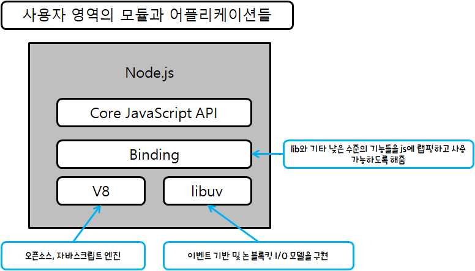

# Welcome Node.js Platform

<hr>

## 1.1 Node.js 철학

### - 경량코어

### - 경량 모듈

*작은 것이 아름답다.<br>*
*각 프로그램이 각기 한 가지 역할을 잘 하도록 만든다.*

**작은 모듈 장점**

0. 재사용성
1. 이해하기 쉽고 사용하기 쉽다.
2. 테스트 및 유지보수가 훨씬 간단하다.
3. 브라우저와 완벽한 공유가 가능하다.

> **DRY**  (Don't Repeat Youself ㅋㅋㅋㅋㅋ)

### - 작은 외부 인터페이스

Node.js 모듈은 크기와 범위가 작을 뿐만 아니라 대개 최소한의 기능을 노출하는 특성을 가지고 있음<br>
-> API의 유용성이 향상됨 (API 사용이 보다 명확해지고 잘못된 사용에 덜 노출됨)

Node.js에서 모듈을 정의하는 가장 일반적인 패턴<br>
함수나 생성자와 같이 하나의 핵심 기능을 표현하는 동시에, 더 많은 고급기능이나 보조 기능은 노출된 함수나 생성자의 속성이 되도록 한다.

단순히 확장하는 용도보다는 실제 사용하도록 만들어짐.

### - 간결함과 실용주의

> *KISS (Keep It Simple, Stupid)* <br>

> *단순함이야말로 궁극의 정교함이다.*

<hr>

## 1.2 Node.js 6와 ES2015에 대한 소개

### - let & const

### - 화살표 함수(arrow function)

화살표함수는 항상 익명이다.

그리고 어휘 범위(lexical scope)로 바인드 된다. 즉, 화살표 함수 내부의 this값은 부모 블록의 값과 같다.

```javascript
const numbers = [2, 6, 7, 8, 1];
const even = numbers.filter(function (x) {
    return x % 2 === 0;
})
```

```javascript
const numbers = [2, 6, 7, 8, 1];
const even = numbers.filter(x => x % 2 === 0);
```

```javascript
const numbers = [2, 6, 7, 8, 1];
const even = numbers.filter(x => {
    if (x % 2 === 0) {      // == 보다는 ===을 사용하는 습관을 들이자!
        console.log(x + 'is 짝수!')
        return true
    }
});
```

### - 클래스 구문

```javascript
// 프로토타입 기반의 Person 함수
function Person(name, surname, age) {
    this.name = name;
    this.surname = surname;
    this.age = age;
}

Person.prototype.getFullName = function () {
    return this.name + '' + this.surname;
};

Person.older = function (person1, person2) {
    return (person1.age >= person2.age) ? person1 : person2;
}
```

```javascript
// ES2015 클래스 구문을 사용한 Person 함수
class Person {
    constructor(name, surname, age) {
        this.name = name;
        this.surname = surname;
        this.age = age;
    }

    getFullName() {
        return this.name + '' + this.surname;
    };

    static older(person1, person2) {
        return (person1.age >= person2.age) ? person1 : person2;
    }
}
```

static 메서드는 정적 메서드로 클래스의 인스턴스 없이 호출이 가능하며 클래스가 인스턴스화되면 호출할 수 없다.<br>
정적 메서드는 종종 어플리케이션의 유틸리티 함수를 만드는데 사용됨.

### - 향상된 객체 리터럴

변수 및 함수를 객체의 멤버로 지정하고, 객체를 생성할 때 동적인 멤버명을 정의할 수 있도록 하며, 편리한 setter 및 getter 함수를 제공한다.

```javascript
const x = 22;
const y = 17;
const obj = {x, y}
```

```javascript
// function 키워드를 지정할 필요가 없음
module.exports = {
    square(x) {
        return x * x;
    },
    cube(x) {
        return x * x * x;
    }
}
```

```javascript
// 동적으로 속성 명을 사용 -> 프론트에서 사용하기 좋은건가...?
const namespace = '-webkit-'
const style = {
    [namespace + 'box-sizing']: 'border-box',
    [namespace + 'box-sizing']: '10px10px5px #888888',
}
```

```javascript
// setter 랑 getter
const person = {
    name: 'George',
    surname: 'Boole',

    get fullname() {
        return this.name + '' + this.surname
    },

    set fullname(fullname) {
        let parts = fullname.split('');
        this.name = parts[0];
        this.surname = parts[1];
    }
};

console.log(person.fullname); // "George Boole"
console.log(person.fullname = 'Alan Turing'); // "Alan Turing"
console.log(person.name); // "Alan"
```

### - Map과 Set Collection

[참고자료 - Map과 Set 정리](https://ko.javascript.info/map-set)

### - WeakMap 및 WeakSet Collection

WeakMap은 Map과 비슷하다. WeakMap은 가지고 있는 요소 전체를 반복 구문으로 탐색할 방법이 없으며, 객체 만을 키로 가질 수 있다.

WeakMap의 특징은 키로 사용된 객체에 대한 유일한 참조가 WeakMap 내에서만 남아 있을 경우, 이 객체를 GC(Garbage Collect)할 수 있다는 것이다.

```javascript
let obj = {};
const map = new WeakMap();
map.set(obj, {key: "some_value"});
console.log(map.get(obj)); // {key: "some_value"}
obj = undefined;
// 다음 GC 사이클에서 맵에 관련도니 객체와 데이터가 정리됨
```

WeakSet 또한 WeakSet 내 유일 참조가 남을 경우 해당 객체를 GC 할 수 있다는 것이다.

```javascript
let obj1 = {key: "val1"}
let obj2 = {key: "val2"}
const set = new WeakSet([obj1, obj2]);
console.log(set.has(obj1)) // true
obj1 = undefined // 이제 obj1이 set에서 제거됨
console.log(set.has(obj1)) // false
```

[참고자료 - WeakMap과 WeakSet 정리](https://ko.javascript.info/weakmap-weakset)

### - Template 표기법

`` 사용. 템플릿 표기 구문을 문자열 내에서 ${}의 형식으로 사용하여 변수 또는 표현식 삽입 가능.

```javascript
const name = "MinSoo"
const text = `My name is ${name}`
console.log(text); // "My name is MinSoo"
```

<hr>

## 1.3 Reactor 패턴

Reactor 패턴은 Node.js의 비동기 특성의 핵심이다.

### - I/O는 속도가 느리다.

I/O는 컴퓨터의 기본적인 동작 중에서 가장 느리다. I/O는 일반적으로 CPU측면에서 비용이 많이 들지 않지만, 요청을 보낸 순간부터 작업이 완료되는 순가까지 지연을 동반하게 된다.

### - 블로킹 I/O

전통적인 블로킹 I/O 프로그래밍에서는 I/O 요청에 해당하는 함수 호출은 작업이 완료될 때까지 스레드의 실행이 차단된다.

```javascript
// 데이터를 사용할 수 있을 때까지 스레드가 블록됨.
data = socket.read();
// 데이터 사용 가능
print(data);
```

각 소켓에서의 모든 I/O 작업이 다른 연결 처리를 차단할 것이기 때문에, 블로킹 I/O를 사용하여 구현된 웹 서버가 동일한 스레드에서 여러 연결을 처리할 수는 없다.

그렇기에 웹 서버에서 동시성을 처리하기 위한 전통적인 접근 방식은 처리해야 하는 각가의 동시 연결에 대해 새로운 스레드 또는 프로세스를 시작하거나 풀에서 가져온 스레드를 재사용 하는 것이다.

이렇게 해서 스레드가 I/O 작업으로 차단되어도 분리된 스레드에서 처리되므로 다른 요청의 가용성에는 영향을 미치지 않는다.


### - 논 블로킹 I/O

데이터가 읽히거나 쓰여질때까지 기다리지 않고 항상 즉시 반환된다. 호출하는 순간에 결과를 사용할 수 없는 경우, 이 함수는 단순히 미리 정의된 상수를 반환하여 그 순간에 반환할 수 있는 데이터가 없음을 나타낸다.

ex) Unix 운영체제에서 fcntl()함수는 기존 파일 디스크립터(file descriptor)를 조작하여 운영 모드를 논 블로킹으로 변경하는데 사용한다.

이러한 종류를 논 블로킹 I/O에 액세스하는 가장 기본적인 패턴은 실제 데이터가 반환될 때까지 루프 내에서 리소스를 적극적으로 폴링(polling) 하는 것이다. 이를 **busy-waiting** 이라고 한다.

### - 이벤트 디멀티플렉싱

> 디멀티플렉서 - 디멀티플렉서(demultiplexer, demux)는 하나의 입력 신호를 받아서 수많은 데이터 출력선 중 하나를 선택하는 장치를 말하며 단일 입력으로 연결된다
[ 출처: [위키](https://ko.wikipedia.org/wiki/%EB%A9%80%ED%8B%B0%ED%94%8C%EB%A0%89%EC%84%9C) ]

효율적인 논 블로킹 리소스 처리를 위한 기본적인 메커니즘 -> 동기 이벤트 디멀티플렉서 (이벤트 통지 인터페이스)

감시된 일련의 리소스들로부터 들어오는 I/O 이벤트를 수집하여 큐에 넣고 처리할 수 있는 새 이벤트가 있을 때까지 차단함.

```javascript
// pseudo code
socketA, pipeB;
watchedList.add(socketA, FOR_READ);
watchedList.add(pipeB, FOR_READ);
while (events = demultiplexer.watch(watchedList)) {
    foreach(event in events)
    {
        //여기서 read는 블록되지 않으며, 비어 있어도 항상 데이터를 반환함.
        data = event.resource.read();
        if (data === RESOURCE_CLOSED)
            //리소스가 닫혔기 때문에, 리소스 목록에서 제거
            demultiplexer.unwatch(event.resource)
        else
            // 실제 데이터 도착->처리
            consumeData(data);
    }
}
```


### - Reactor 패턴 소개

각 I/O 작업과 관련된 핸들러(Node.js에서 callback 함수로 표시)를 갖는 것. 이 핸들러는 이벤트가 생성되어 이벤트 루프에 의해 처리되는 즉시 호출됨.

> reactor패턴은 이벤트 핸들 패턴의 전형적인 모습이다. application이 능동적으로 계속해서 처리하기위한 루프를 도는 것이 아니라, 이벤트에 반응하는 객체(reactor)를 만들고, 사건(이벤트)이 발생하면 application대신 reactor가 반응하여 처리하는 것이다. reactor는 이벤트가 발생하길 기다리고, 이벤트가 발생하면 event handler에게 이벤트를 발송한다. 따로 application에서 event를 대기하고 분할하는 작업을 하지 않아도 동작할 수 있기 때문에 이벤트 multiplexing을 구현하는데 좋은 구조이다. <br>출처: https://ozt88.tistory.com/25 [공부 모음]


1. 어플리케이션은 **이벤트 디멀티 플렉서**에 요청을 전달함으로써 새로운 I/O 작업을 생성함. 또한 어플리케이션은 처리가 완료될 때 호출될 핸들러를 지정함. **이벤트 디멀티 플렉서**에 새 요청을 전달하는
   것ㅇ느 논 블로킹 호출이며, 즉시 어플리케이션에 제어를 반환함.

2. 일련의 I/O 작업들이 완료되면 **이벤트 디멀티 플렉서**는 새 이벤트를 **이벤트 큐**에 집어넣음

3. 이 시점에서 **이벤트 루프**가 **이벤트 큐**의 항목들에 대해 반복함

4. 각 이벤트에 대해서 관련된 핸들러가 호출됨

5. 어플리케이션 코드의 일부인 핸들러는 실행이 완료되면 **이벤트 루프**에 제어를 되돌림(5a). 그러나 핸들러의 실행 중에 새로운 비동기 동작이 요청(5b)이 발생하여 제어가 **이벤트 루프**로 돌아가기 전에
   새로운 요청이 **이벤트 디멀티 플렉서(1)**에 삽입될 수도 있음.

6. **이벤트 큐** 내의 모든 항목이 처리되면, 루프는 **이벤트 디멀티 플렉서**에서 다시 블록되고 처리 가능한 새로운 이벤트가 있을 때 이 과정이 다시 트리거될 것임.

> Node.js 어플리케이션은 이벤트 디멀티플레서에 더 이상 보류 중인 작업이 없고 이벤트 큐에서 더 이상 처리할 이벤트가 없을 때 자동으로 종료됨.

### - Node.js의 논 블로킹 엔진 libuv

libuv는 기본 시스템 호출을 추상화하는 것 외에도 Reactor 패턴을 구현하고 있으므로 이벤트 루프를 만들고, 이벤트 큐를 관리하며, 비동기 입출력 작업을 실행하고, 다른 유형의 작업을 큐에 담기위한 API들을
제공한다.

### - Node.js를 위한 구조

