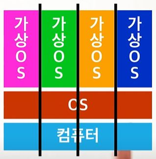
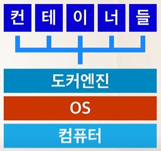

# Docker

Docker란? 

참고 -> https://www.youtube.com/watch?v=tPjpcsgxgWc

분리된 작업공간(독립된 업무공간 구축) => Container.
Docker만 있으면 docker hub에 업로드한 장비들을 내가 지정한 형태한 형태로 어디든 설치할 수 있고, 
장비들에 문제가 생기더라도 그냥 새로 복원이 가능.

같은 곳의 다른 비품들과 서로 방해하지 않는 해당 작업만의 업무환경을 만들어낼 수 있음.

서버를 돌리기 위한 환경을 구축하는데 도움이 됨.

언어, 웹서버, DB, 자동배포툴 등 여러가지를 버전 신경써서 다운받은 다음, 서로 잘 맞물려 동작할 수 있도록 이것저것 설정해야함.

근데 서버를 운영하다보면 더 성능 좋은 서버로 옮겨가거나, 늘어난 접속량 처리를 위해 서버를 여럿 추가해야 하게 될 수 있음..

그러면 또 일일이 다 설치해줘야함. 이걸 한명이 하면 그나마 나은데 그게 아닐 가능성이 높으니깐...

뿐만 아니라, 같은 서버에 여러 서비스를 돌리는 경우, 각각이 다른 실행환경에서 동작해야 할 때 일이 까다로워 질 수 있음.

예를들어 기존서버는 java7이었는데 새서비스가 java8에서 동작하는거면 또 이것저것 신경써줘야함.

먼저 각 요소들이 설치된 모습을 이미지라는 형태로 박제해서 저장함. 각 제품마다 공식적으로 제공되는 이미지도 있고,

사용자가 원하는대로 만들어낼 수 도 있음.

git으로 저장된 내용이 github에 올려지는 것처럼, 이 도커 이미지들은 Dockerhub라는 곳에 업로드되서 공유되고 다운 가능. 

그리고 이렇게 이미지로 저장된 항목들이 함께 연결되서 동작하도록 설정된 상태를 명령어 텍스트나 문서 형태로 저장할 수도 있음.

마치 이게 설치되는 과정을 어디서든 컴퓨터가 자동으로 재현할 수 있도록 녹화해둔다는 느낌으로!

이 문서만 잘 보관해두면 이 요소들이 언제 어디서든 미리 지정된, 서비스에 필요한 설정대로 DockerHub로부터 받아져서 설치될 수 있음.

docker는 이것들을 컴퓨터에 바로 설치는 안함. 

각각을 컨테이너라고 불리는 독립된 가상 공간을 만들어내서 복원함. 

때문에 아까 말했던 서비스 처럼 다른 버전의 자바를 돌리는 서비스들도 각각의 컨테이너 안에서 서로 방해받는 일 없이 돌아갈 수 있음.

virtualBox같은 가상 컴퓨팅하고는 다른 구조. 

가상 컴퓨팅은 한 물리적 컴퓨터 안에 각각 OS를 가동하는 가상 컴퓨터들이 물리적 자원을 분할해서 쓰기 때문에 성능에 한계가 있음.

도커는 OS단까지 내려가는게 아니라 실행 환경만 독립적으로 돌리는거라서 
컴퓨터를 직접 요소들을 설치한거랑 별 차이없는 성능을 낼 수 있고, 
가상 컴퓨팅보다 훨씬 가볍고 빠르게 각각을 설치하고 실행하고 켜고 끄고 서로 연동이 가능하다.

그래서 이제는 서버에 뭐가 잘못돼서 고쳐야 하거나, 일부를 업그레이드해야 하거나 할 때는 
일일이 요소들을 정지하고 지우거나 새로 깔거나 할 필요없이 그냥 이 컨테이너들을 통째로 교체해서 
새로 실행하면 됨.

서버를 관리하고 서비스들을 배포하는 일이 쉬워진거임.